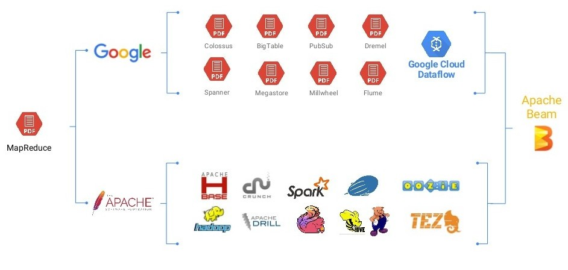

## Agenda
- global concept of our fround detection
- what is dataflow
- what is apache beam
- quickly describe project structure
- descibe the project code 

## Our fraud detector

Sample trade input file:

```
BS,Yotz,25c92654-aac9-4ef0-a532-d1df1612326f,Interactive Brokers LLC,Rabo Securities USA Inc.,57,PAB,Africa,54.98,37.34,3171.20,607.92,Active,41570605,248090018,1880621363,1604158196,2018-04-09,2018-04-10,7a2cc935-eb5c-4be4-b4c0-281d91efed21,2018-04-10T00:00
SS,Zoonder,41f01509-4e8c-448d-abe3-3f725a7634de,Mizuho Securities USA LLC,Cantor Fitzgerald & Co.,7,CDF,Africa,67.32,231.40,702.64,147.40,Correction,351217176,1717896528,794008364,603265844,2018-04-09,2018-04-10,a08e0c40-6fbe-457c-b363-715b514fdc2e,2018-04-10T00:01:26
SS,LiveZ,69cdc3d5-a4f4-4c06-82a3-dfdda3fafabf,Credit Suisse Securities (USA) LLC,Phillip Capital Inc.,6,JMD,Africa,99.97,186.77,786.59,367.04,Correction,56954968,179793288,458087528,2127570952,2018-04-09,2018-04-10,a5876150-a04e-496e-81b3-dfd81df0874f,2018-04-10T00:02:52
BS,Eayo,8732eee6-5714-4fa6-8f37-6b4693b64afb,Term Commodities Inc.,Dorman Trading L.L.C.,49,TZS,Africa,18.65,397.78,1311.63,354.96,Correction,1003755216,427232961,1412676551,713772300,2018-04-09,2018-04-10,c1ff8269-05a5-4c74-8cbd-17d3fb55f5e3,2018-04-10T00:04:19
SL,Skinte,415aa7cb-0948-4e08-af61-bb287f9e7971,Credit Suisse Securities (USA) LLC,BNP Paribas Securities Corp.,32,BGN,Asia,39.85,130.06,1405.26,508.88,Inactive,556105325,1096460217,437062855,136211935,2018-04-09,2018-04-10,0d1da855-87e8-4c3d-9bd3-da42a6f5b0d9,2018-04-10T00:05:45
BS,Yakijo,095cc2dd-629a-477a-b883-56f1e0d39f3d,HSBC Securities (USA) Inc.,Rand Financial Services Inc.,8,TND,America,48.79,123.87,514.19,160.58,Correction,1613434408,144675993,1712279215,803879096,2018-04-09,2018-04-10,48027d71-a7b8-45ca-ad67-3e8d8d29a02b,2018-04-10T00:07:12
SL,Centimia,23b44591-03e4-4b15-b70f-e7c0310b1d70,Wedbush Securities Inc.,EFL Futures Limited,88,MMK,Africa,84.96,2626.65,10103.13,2231.49,Inactive,163672733,752233789,1843180636,1249479966,2018-04-09,2018-04-10,30dc0091-edf1-4a3f-8317-e9ae171f43ab,2018-04-10T00:08:38
```

Sample rule: Yield fraud when Client has many small trades (value less then 10) but the sum of them is very high (more than 100)

## History of distributed data processing

[](https://raw.githubusercontent.com/gft-academy-pl/gcp-anti-fraud-detector/master/assets/history.jpg)

> Currently, processes over 20 petabytes of data per day through an average of 100,000 MapReduce jobs spread across its massive computing clusters. The average MapReduce job ran across approximately 400 machines in September 2007, crunching approximately 11,000 machine years in a single month.

## Dataflow


Cloud Dataflow is a fully-managed service for transforming and enriching data in stream (real time) and batch (historical) modes with equal reliability and expressiveness. 
And with its serverless approach to resource provisioning and management, you have access to virtually limitless capacity to solve your biggest data processing challenges, while paying only for what you use.

Features:
- **Automated Resource Management** - Cloud Dataflow automates provisioning and management of processing resources to minimize latency and maximize utilization; no more spinning up instances by hand or reserving them.
- **Dynamic Work Rebalancing** - Automated and optimized work partitioning dynamically rebalances lagging work. No need to chase down “hot keys” or pre-process your input data. 


- **Reliable & Consistent Exactly-once Processing** - Provides built-in support for fault-tolerant execution that is consistent and correct regardless of data size, cluster size, processing pattern or pipeline complexity.
- **Horizontal Auto-scaling** - Horizontal auto-scaling of worker resources for optimum throughput results in better overall price-to-performance.
- **Unified Programming Model** - Apache Beam SDK offers equally rich MapReduce-like operations, powerful data windowing, and fine-grained correctness control for streaming and batch data alike.
- **Community-driven Innovation** - Developers wishing to extend the Cloud Dataflow programming model can fork and/or contribute to Apache Beam.

## Apache Beam


Basic concepts:

- **PCollections** - the PCollection abstraction represents a potentially distributed, multi-element data set, that acts as the pipeline's data. Beam transforms use PCollection objects as inputs and outputs.
- **Transforms** - these are the operations in your pipeline. A transform takes a PCollection (or multiple PCollections) as input, performs an operation that you specify on each element in that collection, and produces a new output PCollection.
- **Pipeline I/O** - Beam provides read and write transforms for a number of common data storage types, as well as allows you to create your own.
- **Windowing** - subdivides a PCollection according to the timestamps of its individual elements. Transforms that aggregate multiple elements, such as GroupByKey and Combine, work implicitly on a per-window basis 
- **Triggers** - when collecting and grouping data into windows, Beam uses triggers to determine when to emit the aggregated results of each window (referred to as a pane). If you use Beam’s default windowing configuration and default trigger, Beam outputs the aggregated result when it estimates all data has arrived, and discards all subsequent data for that window


Pipeline operations:
- **Branching pipelines**


- **Merge pipelines**


- **Multiple sources**


Features:
- **Unified** - Use a single programming model for both batch and streaming use cases using Java, Python and other languages.

- **Portable** - Execute pipelines on multiple execution environments like Dataflow, Spark, Flink, Apex, Gearpump or Local.


 
 

- **Extensible** - Write and share new SDKs, IO connectors, and transformation libraries.

## Pipeline to find the frauds

**Code**
- Implementation: https://github.com/gft-academy-pl/gcp-anti-fraud-detector/blob/master/dataflow/detecting-frauds/src/main/java/com/gft/academy/FraudDetector.java
- Test: https://github.com/gft-academy-pl/gcp-anti-fraud-detector/blob/master/dataflow/detecting-frauds/src/test/java/com/gft/academy/FraudDetectorTest.java

```
cd ~/gcp-anti-fraud-detector/dataflow/detecting-frauds
```
 
**Run locally**

- Input: public dataset
- Output: local directory

```
mvn clean compile exec:java \
       -Dexec.mainClass=com.gft.academy.FraudDetector \
       -Dexec.args="--output=./target/frauds/ \
       --inputFile=gs://gft-academy-fraud-detector-public-data/trades-small.csv"
```
 
**Run on the DataFlow**

Enable API in order to be able to operate on DataFlow. Go to API&Services, search for Dataflow, and click Enable button, or use this link: https://console.cloud.google.com/apis/library/dataflow.googleapis.com. You can also do it from command line using `gcloud services enable dataflow.googleapis.com`.

- Input: public dataset
- Output: output bucket

```
mvn clean compile exec:java \
      -Dexec.mainClass=com.gft.academy.FraudDetector \
      -Dexec.args="--project=${GOOGLE_CLOUD_PROJECT} \
      --inputFile=gs://${GCP_INPUT_BUCKET}/trades-small.csv \
      --output=gs://${GCP_OUTPUT_BUCKET}/frauds \
      --tempLocation=gs://${GCP_WORKSPACE_BUCKET}/frauds-tmp \
      --runner=DataflowRunner"
```

**Create job template**

So far we were executing jobs on the Dataflow. We need to create a job template and deploy (stage) it with all dependencies to the available for the Dataflow place - workspace bucket. It can be then created via web or GCP API.

```
mvn clean compile exec:java \
       -Dexec.mainClass=com.gft.academy.FraudDetector \
       -Dexec.args="--project=${GOOGLE_CLOUD_PROJECT} \
       --templateLocation=gs://${GCP_WORKSPACE_BUCKET}/templates/fraud-detector \
       --tempLocation=gs://${GCP_WORKSPACE_BUCKET}/frauds-tmp \
       --runner=DataflowRunner"
```

NPE issue: https://issues.apache.org/jira/browse/BEAM-2400 but the template is created.

## Documentation & Resources
- https://cloud.google.com/dataflow/docs
- https://cloud.google.com/dataflow/docs/quickstarts/quickstart-java-maven
- https://cloud.google.com/dataflow/docs/templates/overview
- https://cloud.google.com/dataflow/docs/templates/creating-templates
- https://cloud.google.com/dataflow/docs/templates/executing-templates

## Navigation

- [Previous Step](./01-storage.md)
- [Next Step](./03-cloud-functions.md)
